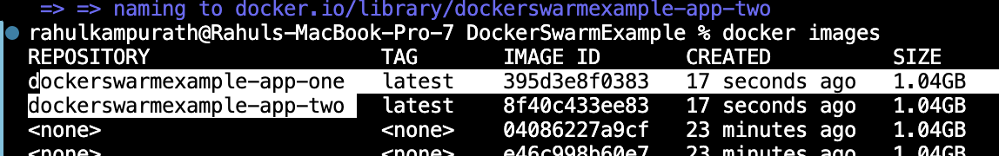

# Nginx docker setup

## How to run the application

1. Docker compose file up command to run containers
    1. Docker for Application One 
    2. Docker for Application Two
    3. Docker for Nginx

## Setting up for nginx

1. create folder conf.d/custom.conf
2. Add conf to listen 80
3. Setting up proxy_pass

## Understanding the Nginx Conf file

```python

# server {} is the main code block
server{
    # This port 80 will listen to all the request coming in this port
    listen 80;

    # This  is for IPV6 support
    listen [::]:80;

    # Server_name is ideally your domain name Eg abc.com
    server_name localhost;

    # Location configuration helps to define URL rules
    location /appone{

        # Proxy_pass will pass/redirect the request to the specific container .
        #[NOTE: This port number is the internal port of the cotainer as we are using container name here Eg.flask_app_one ]
        proxy_pass http://flask_app_one:5000/;

        #proxy_pass_header Server;
        #proxy_set_header Host $http_host;
        #proxy_redirect off;
        #proxy_set_header X-Real-IP $remote_addr;
        #proxy_set_header X-Scheme $scheme;
        #proxy_set_header X-Forwarded-For #$proxy_add_x_forwarded_for;

        # This configuration helps to define time out for api requests
        proxy_connect_timeout 30;
        proxy_read_timeout 30;
    }
```

## Docker compose changes for nginx

1. Add network for all containers
2. Mount configuration file via volume

## Check Reverse proxy for Nginx

1. navivate to localhost/appone it will redirect to App One ( 5001)
2. Navigate to localhost/apptwo will redirect to App Two ( 5002)

# Docker swarm changes

## User prebild images instead of build statement 
In your Docker Compose file, you are using the build directive for building the images locally from Dockerfiles. However, when deploying services in Docker Swarm, you typically need to provide pre-built images that Swarm can distribute across the nodes.
```
docker-compose -f docker-compose.yml build

```



## Docker compose changes

### -> Add deploy replica options
```
    deploy:
      replicas: 2


```
### -> Remove the container names

### -> Replace images with build in docker compose


## Initialise the swarm :
docker swarm init is used to initialize Docker Swarm on a node, making it a swarm manager. This command sets up the node to be able to orchestrate containers as part of a Swarm.

```
docker swarm init

```

## Final docker compose file 
```
version: '3.8'
services:
  app-one:
    image: dockerswarmexample-app-one
    ports:
      - "5001:5000"
    deploy:
      replicas: 2

  app-two:
    image: dockerswarmexample-app-two
    ports:
      - "5002:5000"
    deploy:
      replicas: 2

  nginx:
    image: nginx:latest
    volumes:
      - ./conf.d:/etc/nginx/conf.d
    restart: on-failure
    ports:
      - "80:80"
    deploy:
      replicas: 2
      constraints:
        - node.role == manager


```


## Docker compose run 

```
docker stack deploy -c docker-compose.swarm.yml my-stack
```

## change the configuration in custom.conf file to replace the container names

```
   proxy_pass http://my-stack_app-one:5000/; With stack details instead of container name
```
